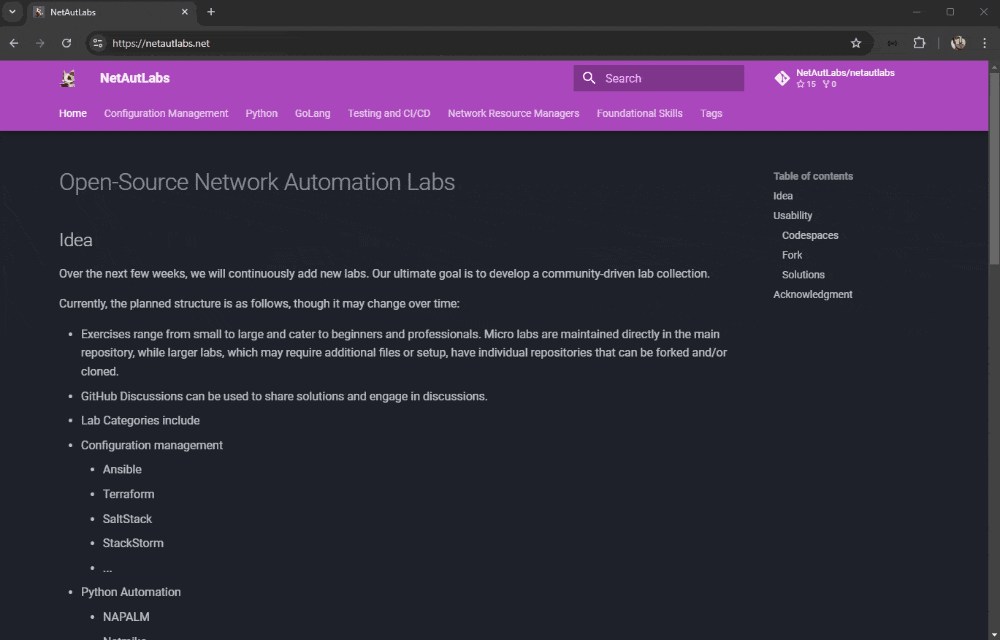

---
hide:
  - navigation
---
# Open-Source Network Automation Labs

## Idea

Over the next few weeks, we will continuously add new labs. Our ultimate goal is to develop a community-driven lab collection.

Currently, the planned structure is as follows, though it may change over time:

- Exercises range from small to large and cater to beginners and professionals. Micro labs are maintained directly in the main repository, while larger labs, which may require additional files or setup, have individual repositories that can be forked and/or cloned.
- GitHub Discussions can be used to share solutions and engage in discussions.
- Lab Categories include
  - Configuration management
    - Ansible
    - Terraform
    - SaltStack
    - StackStorm
    - ...
  - Python Automation
    - NAPALM
    - Netmiko
    - Nornir
    - ...
  - GoLang Automation
    - gNMI
    - ...
  - Testing and CI/CD
    - NUTS
    - ANTA
    - ondatra
    - Batfish
    - ...
  - Network Resource Managers
    - NetBox
    - Nautobot
    - Infrahub
  - Foundational Skills
    - Git
    - YAML
    - Jinja
    - YANG
    - Linux

## Usability

### Codespaces

The Opensource Network Automation Labs provide the convenience of starting many labs directly in [GitHub codespaces](https://github.com/features/codespaces). This is an easy way to set up the environment without needing to install it locally.

Please note that within the free tier, users have a limited number of free minutes to utilize codespaces per month. For more details, refer to the [pricing page](https://github.com/features/codespaces#pricing).

### Fork

In order to store your progress and modifications within a git repository, you can easily fork the lab repository. By forking, you create a personal copy of the repository that you can work on independently.

[GitHub - Fork a repository](https://docs.github.com/en/pull-requests/collaborating-with-pull-requests/working-with-forks/fork-a-repo)

### Solutions

The lab GitHub repository includes a Discussion feature, which serves as a valuable platform for sharing and discussing your solutions with fellow learners. This fosters an environment of collaborative learning, where participants can exchange ideas and learn from one another. Join in the discussions and contribute to the growth of the community around Opensource Network Automation Labs.

## Acknowledgment

This project was inspired by the tremendous effort put forth by [Ivan Pepelnjak](https://www.ipspace.net/About_Ivan_Pepelnjak) on the [bgplabs.net](https://bgplabs.net/) project.